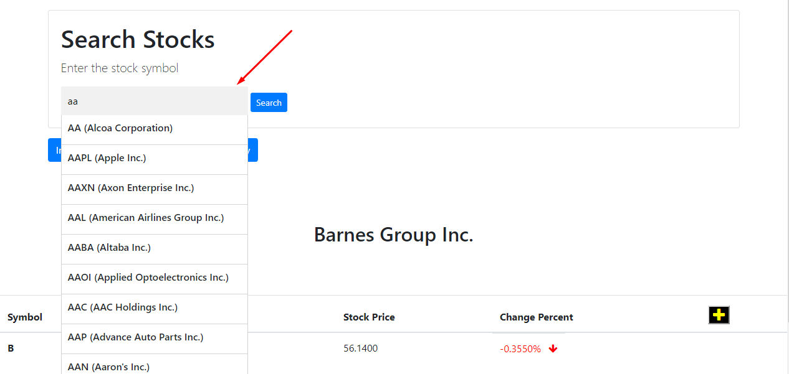
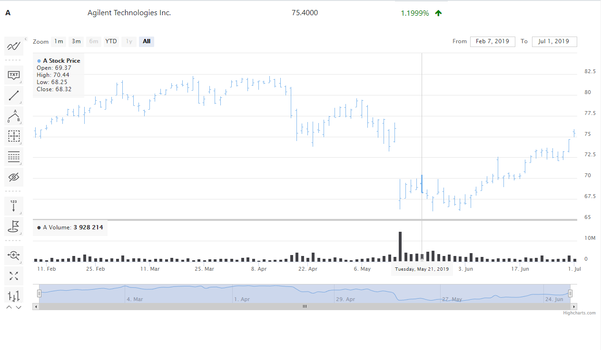
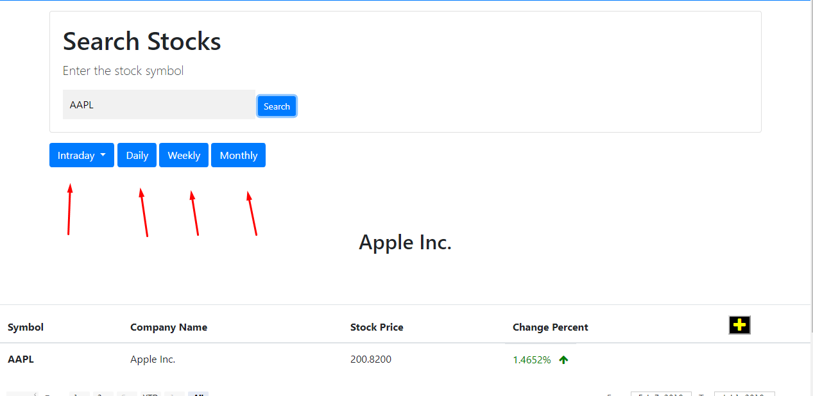
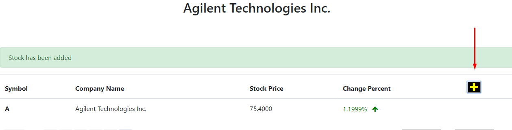
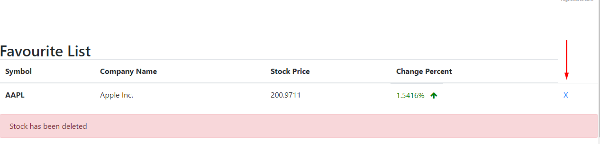

# My 3 project

## live version https://gytisbal.github.io/stocks-API/

## Stock Search using Alpha Vantage

As i progress into learning javascript, created this project to learn more about API calls

doing this project got myself familiar with javascript concepts like OOP, Async/Await functions, fetch API, ES6 classes, increased overall knowledge of how javascript works

## Functionality

this is a responsive web application to search for stock information for companies using the Stock quote API and produced dynamic web content. Created front end using vanila JavaScript, HTML, CSS, Bootstrap. Used FETCH API to get the required data asynchronously. Displayed stock details using Highcharts Framework. Enhanced user experience by providing features like favorite list.

Below are some of the screenshots of how application works.

### in Figure 1, you can enter the company name or symbol, and select from a list using autocomplete.

### The data is parsed and HighCharts framework is used to diplay the chart. 

### You can ues time frame buttons to select what kind of graph you want to see in highcharts 

### You can also use yellow button to add to favourite list

### And of course delete from the list

